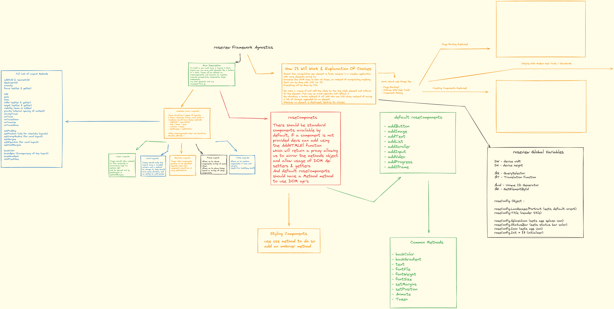

# roseview Framework

roseview is a framework that aims to reduce the complexities we have when using
vanilla web development and those that are inherited by majority of frameworks.

roseview can be classified as a single multipage app framework (SMPA)

roseview aims to keep android app development similarities.

roseview is inspired by DroidScript.

## roseview Explained

Android has the concept of layouts and views, in roseview layouts are refered to as roseViews and components like a button or a text are retered to as roseComponents.

However the main difference is instead of producing an android based ui from each component the native look is chosen.

To get started create an index.html file with this structure:

```html
<!DOCTYPE html>
<html lang="en">
 <head>
  <meta charset="UTF-8" />
  <meta name="viewport" content="width=device-width, initial-scale=1.0" />
  <style id="main"></style>
  <style>
   html,
   body {
    margin: 0;
    width: 100%;
    height: 100%;
    overflow-x: hidden;
   }
  </style>
 </head>

 <body>
  <script type="module">
   import { OnStart } from "./App.js";

   document.addEventListener("DOMContentLoaded", () => {
    OnStart();
   });
  </script>
 </body>
</html>
```

Then your next task is to create an App.js file :

```javascript
import { rsv, roseConfig } from "./roseview/core.js";

roseConfig.Title = "roseView Framework";

export function OnStart() {
 let lay = rsv.CreateLayout("linear", "center");

 rsv.AddLayout(lay);
}
```

You have made a basic app, now it is time to explain that code:

- The OnStart function is basically where your program starts

There are 5 types of layouts, the linear layout describes the contents flow, vertically or horizontally.
There are more but will be described in the exalidraw file below.

Okay so the first parameter is self explainable, the second means how children will be aligned, we can use the options (left, right, bottom, top, center, vcenter, hcenter, h/vcenter)

Then you have to add that layout to the main view, use rsv.Addlayout

The roseConfig object we import is used to define things like the Orientation, Title of the app, Its icon, and Its SplashScreen.

```javascript
roseCofig.Title = "Hello App";
roseConfig.Icon = "./assets/icon.png";
roseConfig.Portrait;
roseConfig.Landscape;
```

roseview provides us with useful global variables :

```javascript
DW = window.innerWidth;
DH = window.innerheight;

$Q = document.querySelector
$E = document.getElementById

$T = Translation utility
$Uid = Unique id generator
```

### The Important Part : UI

With roseview, we have default functions that return HTMLElements, with a set of methods we can use to achieve better.

```javascript
rsv.AddButton;
rsv.AddImage;
rsv.AddText;
rsv.AddInput;
rsv.AddHtmlEl;
```

The rest of those functions do not need further explanation except the last one.

`rsv.AddHtmlEl` this function allows us to add html elements that arent available as rsv. functions

However this function is powerful because it allows us to add custom components, thus making roseview the most compatible framework.

And on top of that the `rsv.AddHtmlEl` function returns a proxy in which allows you to access DOM Api's and not binding you to the roseComponent methods.

**With great power comes great responsibility !**

Because roseview's `AddHtmlEl` functions allows direct DOM Api access, it can lead you to shoot yourself in the foot.

When you access the provided setters and getters you may cause reflows and repaints as calculations need to be done behind the scenes which in turn may slow down the application if accessed too many times.

React ships with a virtual DOM, we don't, that VDOM allows them to give you values you ask for without having to ping the real DOM which may cause reflows and repaints.

I advise you use the `batch` method function, which instead of modifying ui using JS, it does it by adding classes to that element which is less intensive on the DOM.

```javascript
let btn = rsv.AddHtmlEl(lay, "button");
/* Do Not Do This, Except If its one call */
btn.style.marginTop = "10px";


btn.batch({
 marginTop: "10px",
 textContent: "Hello World"
});


/* This will make use of document fragments */
```

You can build custom components by extending the roseComponent class and exporting the component and adding it using `AddHtmlEl`. Here is an example :

The TonalButton :

```javascript
import { rsv, roseComponent } from "../roseview/core.js";

/** CSS Code Made By ChatGPT */

const TonalButton = class extends roseComponent {
 constructor(parent, text, width = -1, height = -1) {
  super();
  this.element = rsv.AddHtmlEl(parent, "button");

  this.element.css`
        border: 2px solid #6200ea; /* Material design purple */
        color: #6200ea; /* Text color matching the border */
        background-color: transparent; /* Transparent background */
        font-family: "Archivo", sans-serif;
        font-weight: 500; /* Slightly bolder text for material design */
        font-size: 1rem;
        text-align: center;
        cursor: pointer;
        padding: 0.5rem 1rem; /* Padding for a better appearance */
        transition: background-color 0.3s, color 0.3s; /* Smooth transitions */

        &:hover {
            background-color: #6200ea; /* Purple background on hover */
            color: white; /* White text on hover */
        }

        &:active {
            background-color: #3700b3; /* Darker purple on click */
            border-color: #3700b3; /* Match border to background on click */
        }
        `;

  this.El = this.element.style;

 }

 props(text, width, height){
    this.element.textContent = text;
    width ? (this.El.width = width) : "fit-content";
    height ? (this.El.height = height) : "fit-content";
 }
};

export default TonalButton;
```

Your App.js File :

```javascript
import { rsv, roseConfig } from "./roseview/core.js";

import TonalButton from "./compFolder/tonalButton.js";

roseConfig.Title = "roseView Framework";

export function OnStart() {
 let lay = rsv.CreateLayout("linear", "center");

 let btn = rsv.AddHtmlEl(lay, TonalButton);
 btn.props('Hello World', '200px', 'auto')
 rsv.AddLayout(lay);
}
```

To test this framework fork it and try it out, as of writing this some components may not be supported.

Now Here Is Everything In This Exalidraw made image :


