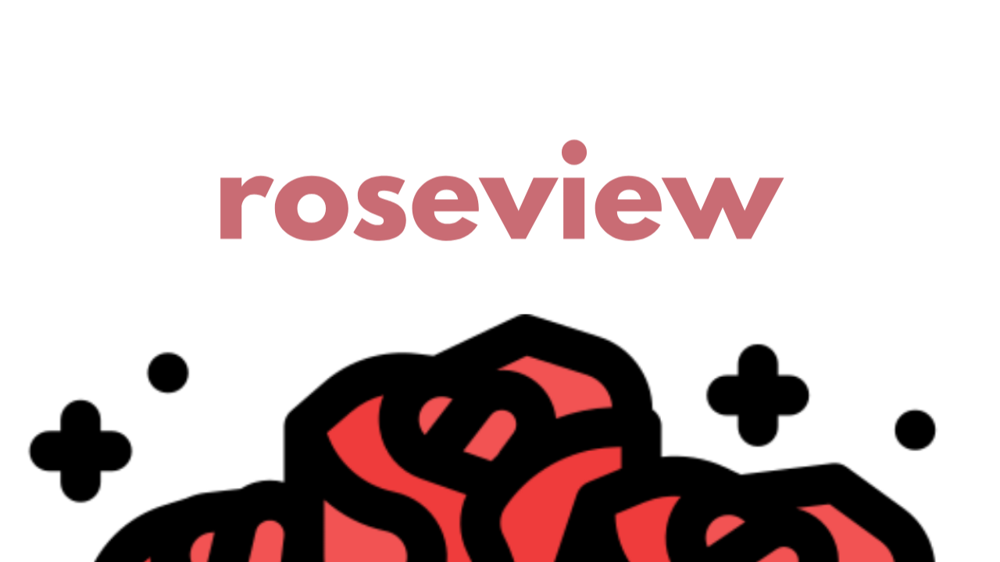

[](LICENSE.md)

# roseview Framework

A small framework that is all batteries included while maintaining ease of use and maintainability.

roseview aims to provide the same amount of usefullness as other big dogs like React and Vue.

The main aim is to do everything differently and still be fast, the first thing is we do not use a VDOM.

Moreover we will ditch any warnings about separation of concerns, everything will be done from the javascript side.

## Getting Started

To get started run this command :

> npx create-roseview-app your-app-name

Wait for the command to finish and install the roseview node module, we use vite.

A folder containing important stuff will be created,

Your main.js file  will look something like this :

```javascript
import { rsvConfig, rsvContainer, rsvElement } from "roseview";

let layout = rsvContainer("linear", "center");

let button = rsvElement(layout, "button", {
 width: "180px",
 height: "auto",
 text: "Hello World 👋"
});

rsvConfig.Application(layout);

rsvConfig.Title = "roseview Framework";

```

### Explaining everything >3

The `roseview.core.js` file exports the following :

```javascript
rsvConfig
rsvElement
rsvContainer 
```

#### rsvConfig

Allows you to set that pages configuration :

```javascript
roseConfig.Icon
roseConfig.Title 
roseConfig.Portrait
roseConfig.Landscape
rsvConfig.Application(mainContainer)
```

#### rsvContainer

A container is a special div, instead of creating a div its advised you prefer to use rsvContainer.

rsvContainer function has these parameters :

```javascript
rsvContainer(type, options)
```

There are 2 types of containers ( linear, frame )

A linear container aligns its children relative to elements within it, while a frame layout allows you to place items over each other, set the position in x or y.

The options parameter, allows you to specify the direction of your children, here are available options :

```console
left, right
top, bottom
center
vcenter,
hcenter,
horizontal, vertical
```

#### rsvElement

rsvElement allows you to add any html element, into your container.

It has the following params :

```javascript
rsvElement(parent, element, props)
```

The parent is the container your element must attach to

The element is an HtmlElement i.e : nav, button, img

The props parameter takes in an object, you can set properties like width, height, text and style.

In this manner :

```javascript
let button = rsvElement(layout, "button", {
 width: "180px",
 height: "auto",
 text: "Hello World 👋"
});
```

rsvElement returns a proxy, a proxy allows us to emulate the roseComponent object and access default setters and getters in javascript, this means you can do this (just as using document.createElement)

### Our Styling Solution

The `style` method of rsvElement allows you to add styles that are scoped to that element

It uses insertRule, in which the browser doesnt have to parse the css nor reflow making it optimal.

In use it looks like this :

```javascript
button.style({
 backgroundColor: "coral",
 color: "white",
 border: "none",
 borderRadius: "4px",
 padding: "12px 24px",
 fontSize: "16px",
 cursor: "pointer",
 transition: "background-color 0.3s, box-shadow 0.3s",

 "&:hover": {
  backgroundColor: "darkorange",
  boxShadow: "0 6px 12px rgba(0, 0, 0, 0.2)"
 },

 "&:active": {
  transform: "translateY(2px)",
  backgroundColor: "#e07b5c",
  boxShadow: "0 2px 4px rgba(0, 0, 0, 0.2)"
 },

 "&:focus": {
  boxShadow: "0 0 0 2px rgba(255, 87, 34, 0.3)"
 }
});
```

## Custom Components

These allow for better code, and we advise only to use functional components !

Here is how to implement one :

```javascript
import { rsvElement } from "roseview";

const outlinedButton = function (parent, text, width, height) {
 let btn = rsvElement(parent, "button", props);

  /* Do not use document.createElement, parent will fail to attach ! */
 
 /* You can make your own props methods */

 props.bold ? btn.style({}) : null

 btn.style({
  border: "2px solid #6200ea",
  color: "#6200ea",
  backgroundColor: "transparent",
  fontFamily: "'Archivo', sans-serif",
  fontWeight: 500,
  fontSize: "1rem",
  textAlign: "center",
  cursor: "pointer",
  padding: "0.5rem 1rem",
  fontFamily: "'Playfair Display', serif",
  fontWeight: 700,
  transition: "background-color 0.3s, color 0.3s",

  "&:hover": {
   backgroundColor: "#6200ea",
   color: "white"
  },
  "&:active": {
   backgroundColor: "#3700b3",
   borderColor: "#3700b3"
  },
  "@media (max-width: 600px)": {
   fontSize: "0.8rem",
   padding: "0.4rem 0.8rem"
  },
  " > span": {
   color: "red"
  }
 });
 return btn;
};

export default outlinedButton;
```

## Roadmap

There is alot to be added in roseview since we aim to make this an all batteries included framework we need to implement the following :

- [ ] createImage
- [ ] createSuspense
- [ ] createRouter
- [ ] createSignal & bindSignal method
- [ ] createState & bindState method

## Contributing

Before you contribute i advise you read the code and follow that code style while following the roseview syntax and simplicity.

- If you find an issue you would like to fix, [open a pull request](#pull-requests).

### Triaging issues and pull requests

One great way you can contribute to the project without writing any code is to help triage issues and pull requests as they come in.

- Ask for more information if you believe the issue does not provide all the details required to solve it.
- Flag issues that are stale or that should be closed.
- Ask for test plans and review code.

Remember small pull requests are much easier to review and more likely to get merged.

Only Oarabile Koore can write code and reproduce no tests !
